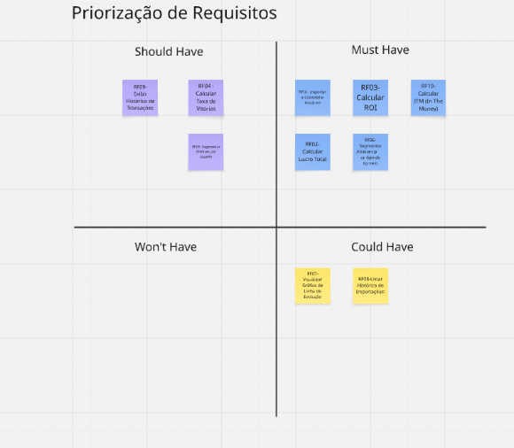
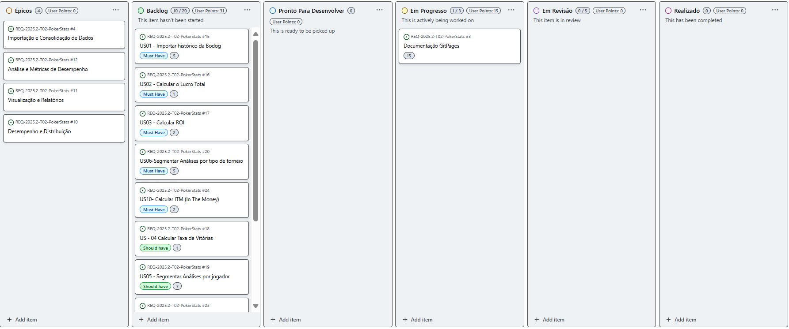
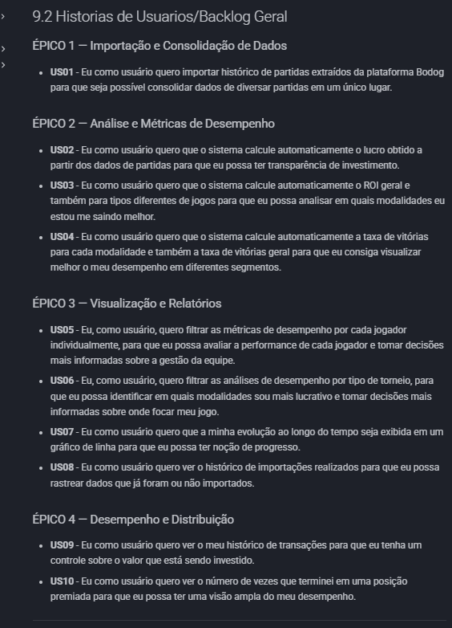
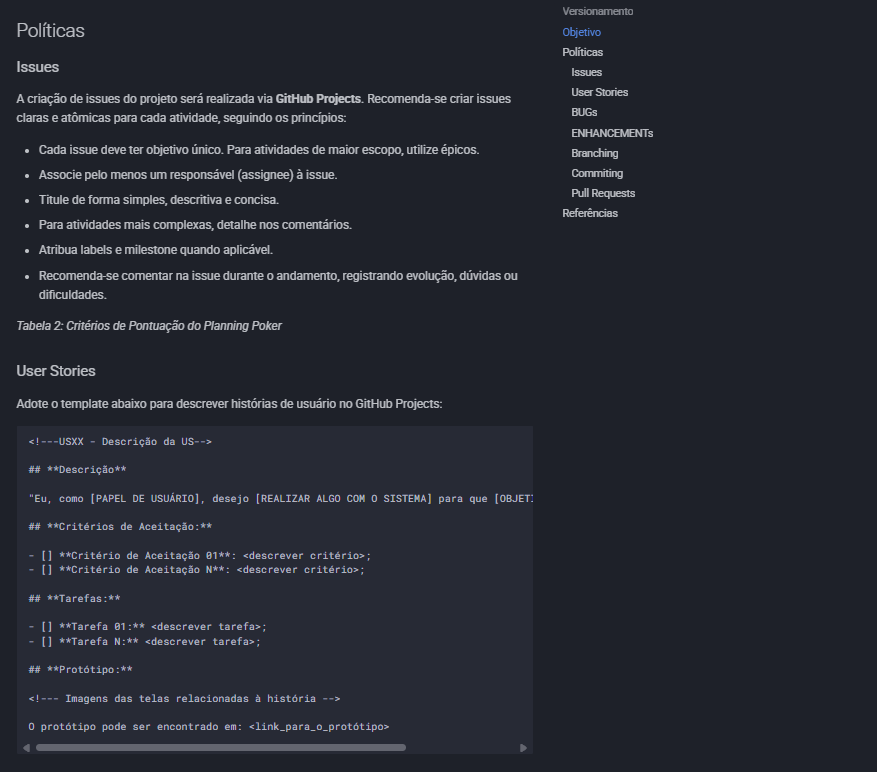
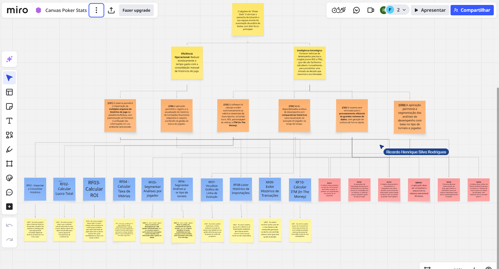
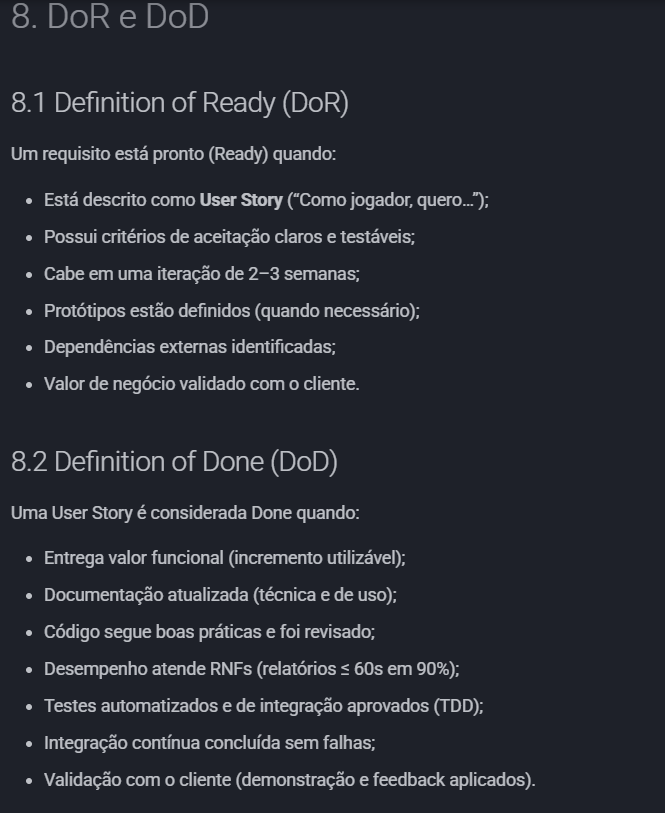
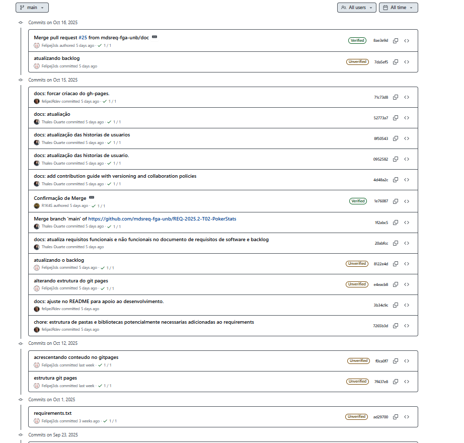
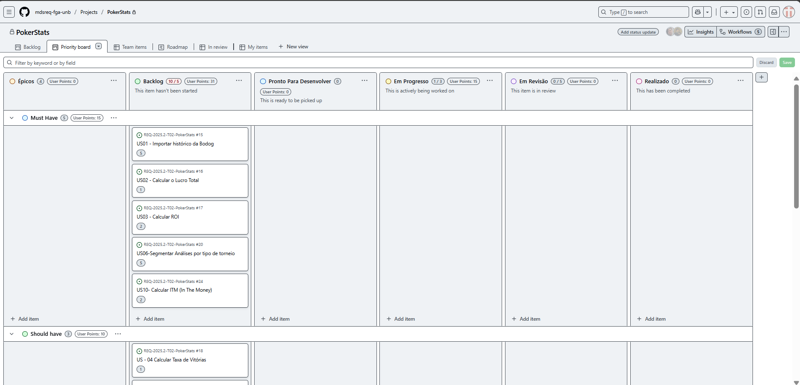
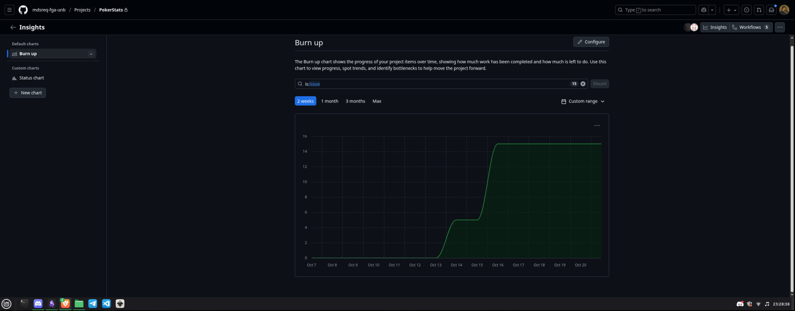

# 10 Evidências de realização das atividades

## Licitação e Descoberta
### **Entrevistas:**
  - **Evidência:** registros, atas, prints ou gravações de reuniões (ou evidências simuladas baseadas nas discussões realizadas).
  - Entrevista - 22/09

  - Entrevista - 04/10

  - Entrevista - 12/10

## Análise e Consenso
### **Priorização Contínua:**
  - **Evidência:** avaliação do valor de negócio dos requisitos registrados no backlog.

### **Visualização do Fluxo de Trabalho:**
  - **Evidência:** quadro Kanban representando o fluxo de trabalho.

### **Discussões em Equipe (Refinamento):** (OK)
  - **Evidência:** prints, gravações de reuniões de refinamento ou os próprios resultados do refinamento.
/Refinamento.png)(../img/Evidencias/3_Declaracao/1CriacaoDeEpicosEUserHistory/Refinamento.png)

### **Implementar Ciclos de Feedback (Kanban + XP):** (NO)
  - **Evidência:** documentação ou registros de reuniões de feedback, retrospectivas.

### **Gerenciamento do Fluxo:** (NO)
  - **Evidência:** prints ou gravações de reuniões onde o fluxo de trabalho é gerido e ajustado.

## Declaração
### **Criação de Épicos e User Stories:**
  - **Evidência:** épicos e user stories documentados no backlog.

### **Tornar as Políticas Explícitas:**
  - **Evidência:** O guia de contribuição: Guia de Contribuição - Poker Stats
  - Link de referência: https://mdsreq-fga-unb.github.io/REQ-2025.2-T02-PokerStats/GuiaDeContribuicao/

## Representação
### **TDD (Test-Driven Development):** (NO)
  - **Evidência:** presença de testes automatizados no código.

### **Protótipos Rápidos:** (NO)
  - **Evidência:** os próprios protótipos desenvolvidos.

### **Refatoração (XP):** (NO)
  - **Evidência:** prints de commits com títulos de “refatoração” ou histórico no repositório que demonstra melhoria contínua do código.

### **Mapa de rastreabilidade:**
  - **Evidência:** O mapa que rastreia a relação Historias de Usuario -> Requisitos -> Caracteristicas de produto -> Objetivos do negocio. 
  

## Verificação e Validação
### **Verificação de DoR (Definition of Ready) e DoD (Definition of Done):**
  - DoR & DoD - Poker Stats
  - **Evidência:** registros dos próprios DoR e DoD utilizados.
  - Link de referência: https://mdsreq-fga-unb.github.io/REQ-2025.2-T02-PokerStats/unidade2/DoR%26DoD/
  

### **Validação de Requisitos por meio de Checklists:**
  - **Evidência:** checklists preenchidos com critérios de aceitação.

### **Propriedade Coletiva do Código (XP):**
  - **Evidência:** histórico de commits mostrando múltiplos autores contribuindo em diversas partes do código.
  

### **Integração Contínua (XP + Kanban):**
  - **Evidência:** print do dashboard da ferramenta de CI (GitHub Actions, Jenkins, etc.) mostrando builds executados e pipelines configurados.

## Organização e Atualização
### **Quadro Kanban:**
  - **Evidência:** o próprio quadro Kanban atualizado e ativo.

### **Limitação do Trabalho em Progresso (WIP):**
  - **Evidência:** quadro Kanban com limites explícitos de WIP por coluna (ex: “Em andamento — máx. 2 tarefas”), prints mostrando o respeito aos limites.

### **Pequenas Entregas:**
  - **Evidência:** histórico de deploys, commits ou releases frequentes.

## Atualização do Processo
### **Ajustes no Quadro Kanban:**
  - **Evidência:** histórico de modificações no Kanban (prints comparando versões, logs de alterações).

### **Refinamento das Políticas Explícitas:**
  - **Evidência:** DoR e DoD.