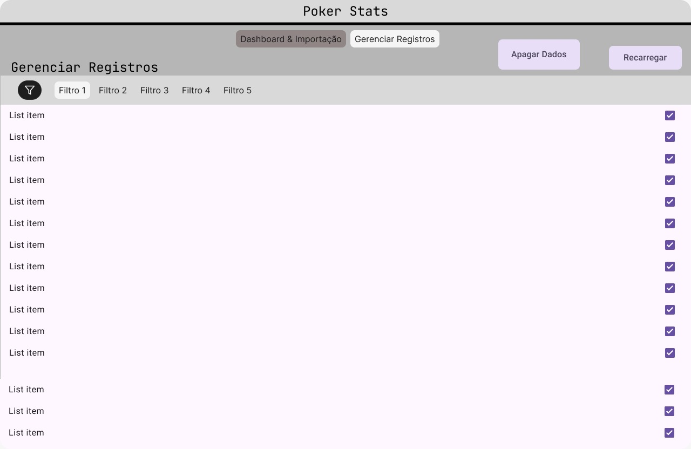
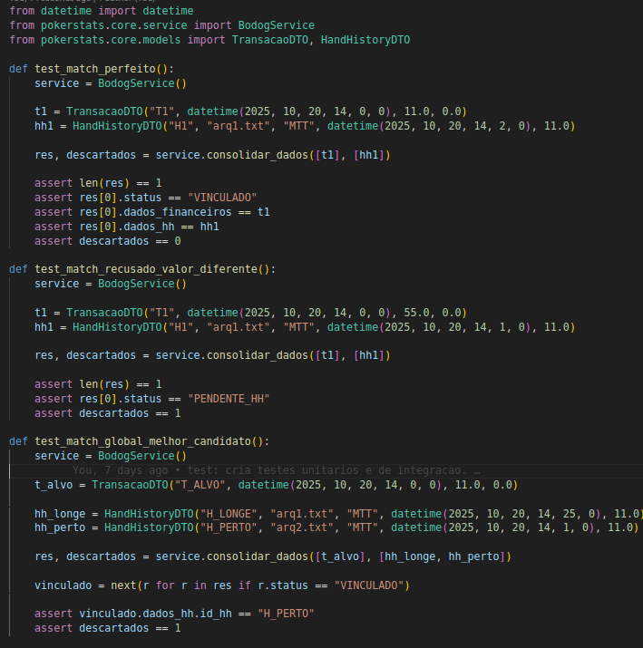
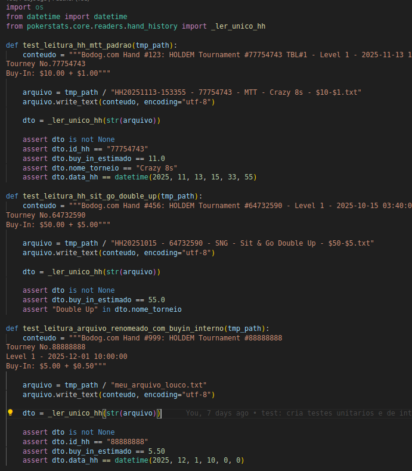
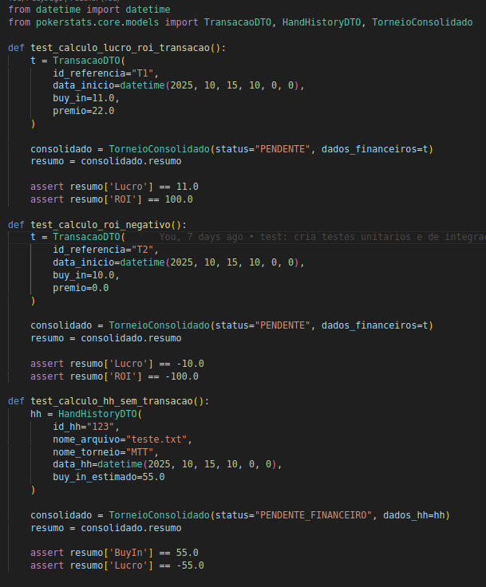
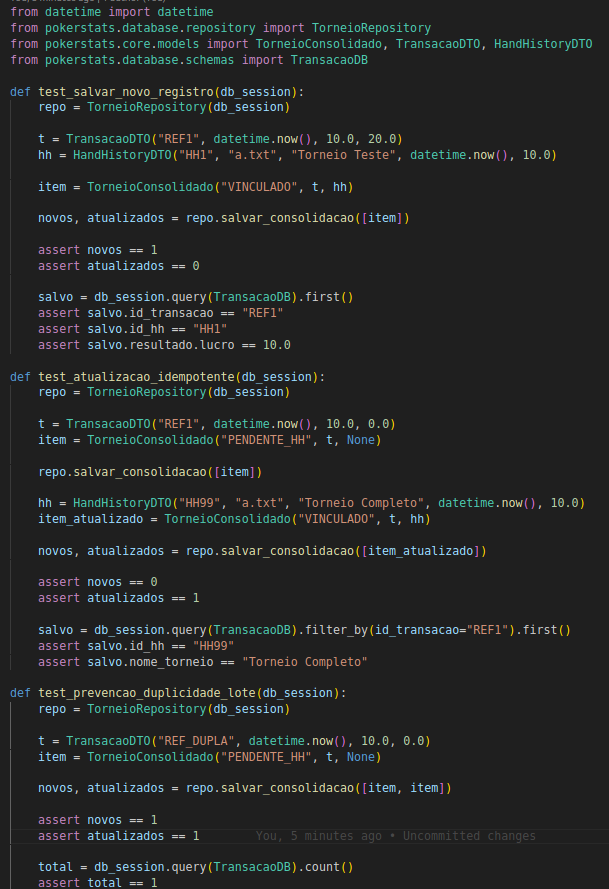
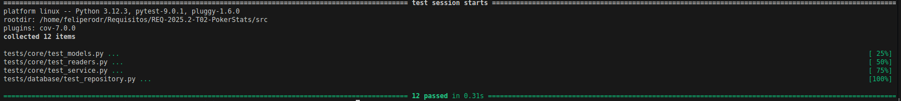

# Evidências de realização das atividades

## Evidencias Atividades de Engenharia de Requisitos

### Elicitação e descoberta

- **Brainstrom**: o print  uma reunião que foi um momento de geração ativa de ideias, não apenas a decisão final ou uma anotação isolada.

<iframe 
    style="border: 1px solid rgba(0, 0, 0, 0.1);" 
    width="800" 
    height="450" 
    src="https://embed.figma.com/design/3lLGO9DloKixcD9EEa0RuK/PokerStats?node-id=5-91&embed-host=share" 
    allowfullscreen>
</iframe>

- **Entrevista**s: Prints de reuniões onde foram apresentados e validados os requisitos definidos ao longo da disciplina para o cliente elem de definidos novos requisitos

- Entrevista de validação 29/09
<iframe width="560" height="315" src="https://www.youtube.com/embed/N3UHlOIR5hU?si=pModmn6tvhfMztN4" title="YouTube video player" frameborder="0" allow="accelerometer; autoplay; clipboard-write; encrypted-media; gyroscope; picture-in-picture; web-share" referrerpolicy="strict-origin-when-cross-origin" allowfullscreen></iframe>

- Entrevista de Validação 04/10

- Entrevista de Validação 12/10

- Entrevista de Validação 20/10

- Entrevista de Validação 01/11

- Entrevista de Validação 01/12

- Análise de concorrentes: Uma analise do Mercado e de produtos similares
(**Eviendicia no tópico 2.4 na aba "solução proposta"**)

### Analise e consenso

- Analise de Custo/Beneficio:
(**Eviendicia no tópico 8.2 na aba "Backlog"**)

- Resolução de Conflito: Algumas conversas da equipe no Software de conversa oficial da equipe Discord para resolver conflitos

### Declaração
 
- User Storys: As historias de usuarios utilizadas para declarar os Requisitos 

(**Eviendicia no tópico 8.1.1 na aba "Backlog"**)

### Respresentação:

- Protótipos: Prototipos visuais feitos para mostrar ao cliente o que vai ser implementado antes de ser implementado

### Verificação e validação

- Dor e Dod: O DoR e DoD

(**Eviendicia no tópico 7.1 e 7.2 na aba "DoR&DoD"**)

- FeedBack do Cliente: Evidencia de validação do produto final do software pelo cliente
<iframe width="560" height="315" src="https://www.youtube.com/embed/PHZwVH9bYmk?si=LqKCEMkLWa8FfVWe" title="YouTube video player" frameborder="0" allow="accelerometer; autoplay; clipboard-write; encrypted-media; gyroscope; picture-in-picture; web-share" referrerpolicy="strict-origin-when-cross-origin" allowfullscreen></iframe>

### Organização e atualização

- Priorização MOSCOW

  <iframe
    src="https://miro.com/app/live-embed/uXjVJ7Qr530=/?embedMode=view_only_without_ui&moveToViewport=-4196,-10896,19952,9636&embedId=420385946116"
    style="position:absolute;left:0;top:0;width:100%;height:100%;border:0;"
    allow="fullscreen; clipboard-read; clipboard-write"
    allowfullscreen>
  </iframe>

> Se o iframe não carregar, abra no navegador:  
> https://miro.com/app/live-embed/uXjVJ7Qr530=/?embedMode=view_only_without_ui&moveToViewport=-4196,-10896,19952,9636&embedId=420385946116

- User points
(**Eviendicia no tópico 8.2.2 na aba "Backlog"**)

## Evidencias Kanban/XP

### Kanban

- O Kanban é focado na visualização do trabalho e fluxo contínuo, então as evidências devem mostrar que organizamos e acompanhamos as tarefas. Apresentaremos evidencia de movimentação real no quadro e criação inicial

- **Quadro Kanban**: Print do kanban mostrando as colunas típicas: Backlog, To Do, Doing, Done.

- **Histórico de atividades**: prints que mostrem mudanças de status das tarefas ao longo do tempo.

### Extreme Programming (XP):

- XP foca em práticas ágeis de desenvolvimento, então as evidências devem mostrar que aplicamos algumas das práticas XP:

- **Iterações curtas/ciclos**: Prints de reuinões que foram marco para ciclo documentado mostrando que houve iterações curtas com entregas iterativas.  
(**As evidências são Prints de reuniões na parte de Elicitação e Descoberto**)

- **Testes Unitarios**:

- **Demonstração incremental ao cliente**: A cada ciclo/iteração, o que foi implementado foi incrementalmente integrado e apresentado ao cliente. 
( **as evidências são os Prints de reuniões na parte de Elicitação e Descoberto**)

