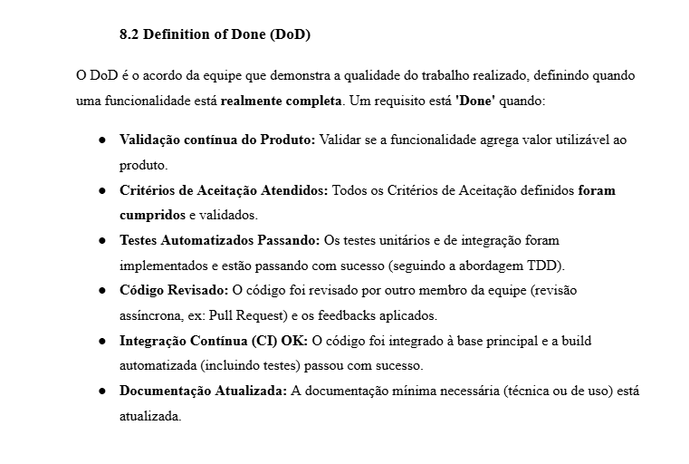
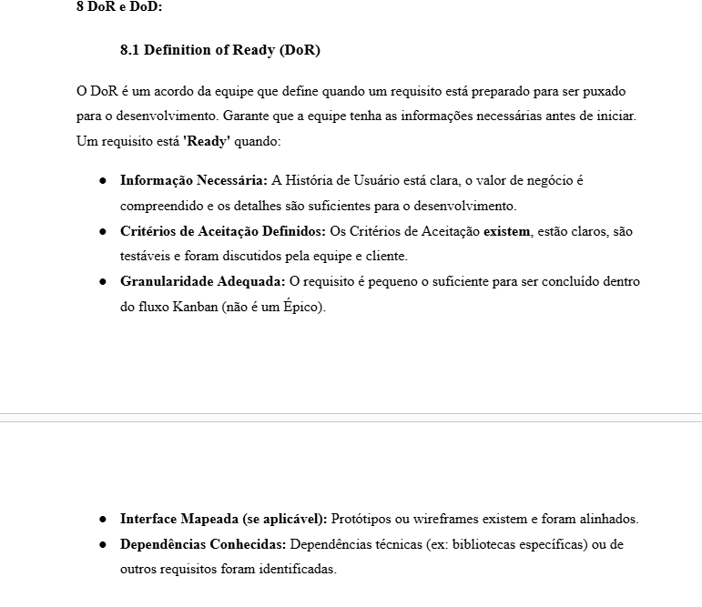
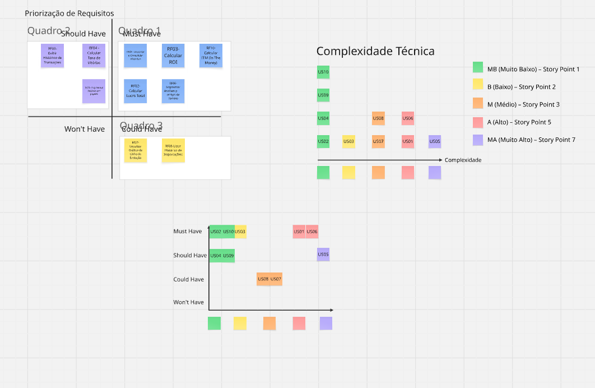
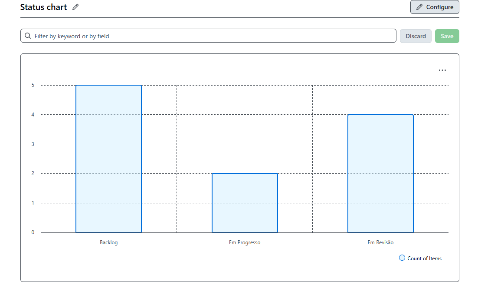

# Evidências de realização das atividades

## Evidencias Atividades de Engenharia de Requisitos

### Elicitação e descoberta

- Brainstrom: o print  uma reunião que foi um momento de geração ativa de ideias, não apenas a decisão final ou uma anotação isolada.

- Entrevistas: Prints de reuniões onde foram apresentados e validados os requisitos definidos ao longo da disciplina para o cliente elem de definidos novos requisitos

- Análise de concorrentes: Uma analise do Mercado e de produtos similares

### Analise e consenso

- Analise de Custo/Beneficio:

- Resolução de Conflito: Algumas conversas da equipe no Software de conversa oficial da equipe Discord para resolver conflitos

### Declaração

- User Storys: As historias de usuarios utilizadas para declarar os Requisitos 

### Respresentação:

- Protótipos: Prototipos visuais feitos para mostrar ao cliente o que vai ser implementado antes de ser implementado

### Verificação e validação

- Dor e Dod: O DoR e DoD

- FeedBack do Cliente: Um forms completo com feedbacks do cliente sobre o produto

### Organização e atualização

- Priorização MOSCOW

- User points

## Evidencias Kanban/XP

### Kanban

- O Kanban é focado na visualização do trabalho e fluxo contínuo, então as evidências devem mostrar que organizamos e acompanhamos as tarefas. Apresentaremos evidencia de movimentação real no quadro e criação inicial

- **Quadro Kanban**: Print do kanban mostrando as colunas típicas: Backlog, To Do, Doing, Done.

- **Histórico de atividades**: prints que mostrem mudanças de status das tarefas ao longo do tempo.

### Extreme Programming (XP):

- XP foca em práticas ágeis de desenvolvimento, então as evidências devem mostrar que aplicamos algumas das práticas XP:

- **Iterações curtas/ciclos**: Prints de reuinões que foram marco para ciclo documentado mostrando que houve iterações curtas com entregas iterativas. 

...

(Prints de reuniões na parte de Elicitação e Descoberto)

- **Test-Driven Development (TDD)**: Prints de código com testes automatizados antes da implementação. Tabela de cobertura de teste.

- **Demonstração incremental ao cliente**: A cada ciclo/iteração, o que foi implementado foi incrementalmente integrado e apresentado ao cliente.

...

(Prints de reuniões na parte de Elicitação e Descoberto)