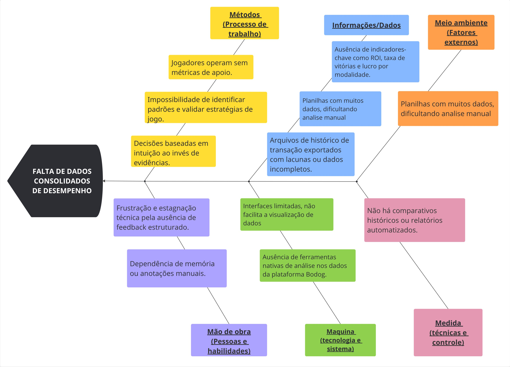

# 1. CENÁRIO ATUAL DO CLIENTE E DO NEGÓCIO

## 1.1 Introdução ao negócio e contexto

O mercado de poker online reúne operadores e grupos de jogadores que realizam partidas regulares em plataformas centralizadas. Nesse contexto, Eduardo administra um grupo de jogadores que atua exclusivamente na plataforma Bodog, concentrando toda a geração de relatórios e registros dessa operação em uma única fonte.

O grupo realiza várias sessões de jogo ao longo do mês, produzindo documentos e arquivos de sessão que registram o histórico das partidas. Atualmente, esses artefatos chegam de forma fragmentada – geralmente como relatórios e planilhas por jogador ou por sessão e o cliente precisa consolidar manualmente essas informações para obter uma visão do desempenho coletivo e individual.

Ao final do mês, com o grande volume de jogos, Eduardo enfrenta o desafio de analisar o que foi mais lucrativo e rentável para o grupo. Ele recebe planilhas da plataforma, mas a organização e a análise se tornam difíceis devido ao grande volume de torneios, às limitações dos dados presentes nessas planilhas e à complexidade de calcular métricas importantes como win rate e lucro de forma manual. Essa dificuldade o impede de focar nas escolhas certas para a gestão do grupo.

## 1.2 Identificação da oportunidade ou problema

A principal oportunidade identificada no cenário do cliente reside na falta de ferramentas de análise de desempenho que se adequem às preferências e ao contexto específico do grupo de Eduardo. Embora existam ferramentas de rastreamento e análise de desempenho no mercado (geralmente soluções terceirizadas como o PokerTracker), elas não atendem à necessidade do usuário por uma plataforma personalizada, minimalista e focada em suas métricas de interesse. O cliente e seu grupo, que participam dos jogos, são forçados a operar com pouca compreensão clara de seu histórico financeiro e de performance, pois as soluções existentes não lhes proporcionam a visão desejada ou sobrecarregam com informações irrelevantes.

O problema central que o projeto "Poker Stats" visa resolver é a "cegueira" do cliente em relação aos resultados do seu grupo. Sem acesso fácil e consolidado a métricas vitais que se alinham às suas preferências, como lucro total, lucro por torneio, Retorno Sobre Investimento (ROI), histórico de transações de conta e porcentagem de vitórias, os jogadores não conseguem:

* Identificar padrões de desempenho: Dificuldade em reconhecer onde e quando são mais bem-sucedidos, como em quais tipos de torneios/mesas ou com quais estilos de jogo se destacam.  
* Avaliar e ajustar estratégias: Impossibilidade de analisar a eficácia das suas abordagens de jogo e determinar os ajustes necessários.  
* Tomar decisões informadas: Ausência de dados concretos para decidir sobre a gestão da banca (bankroll), o tipo de jogo a focar ou quando aumentar/diminuir os limites, baseado em informações claras e relevantes.  
* Aprimoramento contínuo: A falta de feedback numérico e estatístico que se alinha às suas preferências impede que o jogador visualize sua evolução e corrija falhas.

O "Poker Stats" surge para iluminar esse cenário, oferecendo uma plataforma personalizada, minimalista e focada nas métricas de interesse do usuário. A oportunidade é informar o cliente com o conhecimento necessário para gerenciar sua banca de forma inteligente, aprimorar sua visão geral sobre a performance do grupo e, em última instância, transformar uma atividade baseada em intuição em uma prática baseada em dados relevantes e acessíveis.

**Figura 1** - Diagrama de Ishikawa.

## 1.3 Desafios do Projeto

O desenvolvimento do "Poker Stats" apresenta desafios técnicos e operacionais significativos que exigem planejamento cuidadoso e soluções robustas para garantir a entrega de uma ferramenta eficaz e confiável. Os principais obstáculos a serem superados incluem:

**Desafios na Aquisição e Consistência de Dados:**  

  * Incompletude e Limitação dos Dados da Plataforma (Bodog): Embora focado inicialmente na plataforma Bodog, o principal desafio reside na natureza dos dados disponibilizados por ela. Os históricos de mãos ou relatórios de transações podem carecer de detalhes específicos ou serem incompletos em relação a todas as métricas desejadas para uma análise aprofundada. Isso exige métodos inteligentes para inferir ou complementar informações ausentes.  
  * Confiabilidade da Coleta: A dependência de métodos de importação de dados por parte do usuário (como o upload de históricos de mãos exportados) exige que o sistema seja resiliente a possíveis incompletudes ou erros nos arquivos de origem, especialmente devido às limitações do Bodog.  
  * Volume e Qualidade dos Dados: O Poker Stats precisará lidar com um volume potencialmente grande de dados de jogo e transações financeiras. Garantir a integridade, precisão e ausência de duplicações nesses dados é fundamental para a credibilidade das estatísticas geradas, especialmente ao lidar com a qualidade dos dados fornecidos pela fonte.  

**Desafios Técnicos no Processamento e Análise de Dados:**  

  * Cálculo de Métricas Complexas: Desenvolver algoritmos precisos para o cálculo de métricas avançadas de poker (como ROI ajustado, variância) exige um entendimento aprofundado das nuances do poker e da estatística.  
  * Otimização de Performance: Processar grandes volumes de dados de forma rápida e eficiente para gerar relatórios e visualizações em tempo hábil é crucial para a experiência do usuário. Otimização de banco de dados e de algoritmos serão necessárias.  
  * Escalabilidade da Arquitetura: A arquitetura do sistema deve ser projetada para escalar horizontalmente, suportando um número crescente de usuários e o volume de dados gerado por eles ao longo do tempo.  

**Desafios de Interface e Experiência do Usuário (UI/UX):**  

  * Visualização de Dados Complexos: O principal desafio é transformar dados numéricos e estatísticos complexos em gráficos, tabelas e painéis intuitivos e de fácil compreensão para jogadores de diferentes níveis de familiaridade com análise de dados.  
  * Personalização e Flexibilidade: Permitir que o usuário personalize quais métricas visualizar, aplique filtros (por tipo de jogo, buy-in, período) e configure seus próprios relatórios de forma simples.  
  * Acessibilidade e Usabilidade: Garantir que a ferramenta seja acessível e fácil de usar para todos os usuários, desde os menos experientes em tecnologia até os mais avançados.  

**Desafios de Manutenção e Sustentabilidade:**  

  * Adaptação a Mudanças na Plataforma: A plataforma Bodog pode alterar seus formatos de logs, interfaces ou regras de jogo. O "Poker Stats" precisará ser flexível para se adaptar rapidamente a essas mudanças e garantir a continuidade da coleta e processamento de dados.  
  * Concorrência e Diferenciação: Embora o problema de falta de métricas seja claro, o mercado pode ter outras soluções (mesmo que parciais ou mais complexas). O desafio é manter o "Poker Stats" relevante e diferenciado.  
  * Suporte aos Usuários: Fornecer suporte adequado aos usuários para garantir a utilização eficaz da ferramenta e resolver eventuais problemas.

## 1.4 **Segmentação do cliente**

O público-alvo do "Poker Stats" é Eduardo, que busca aprimorar sua compreensão sobre seus próprios resultados por meio de métricas e estatísticas detalhadas. A ferramenta foi concebida para ser acessível a ele e, embora seus amigos estejam envolvidos nos jogos, o foco principal da solução é atender às necessidades de análise de Eduardo.

* **Jovens Adultos Casuais (20-30 anos):** Este segmento principal inclui Eduardo e seu grupo de amigos, que jogam poker online de forma casual, principalmente para diversão e socialização. Embora não sejam jogadores profissionais, eles demonstram interesse em entender melhor seu desempenho, identificar padrões e tomar decisões mais informadas sobre seus jogos, buscando uma visão clara de seus resultados sem a complexidade de ferramentas avançadas.

## Histórico de Versões

**Tabela 1** - Histórico de versões.

| Versão |        Descrição         |                      Autor(es)                      |    Data    |
| :----: | :----------------------: | :-------------------------------------------------: | :--------:  
|  1.0   | Criação do documento | [Renan Pereira](https://github.com/renanpr7)     | 15/09/2025 | 
|  2.0   | Ajustes do documento | [Renan Pereira](https://github.com/renanpr7)     | 15/10/2025 | 