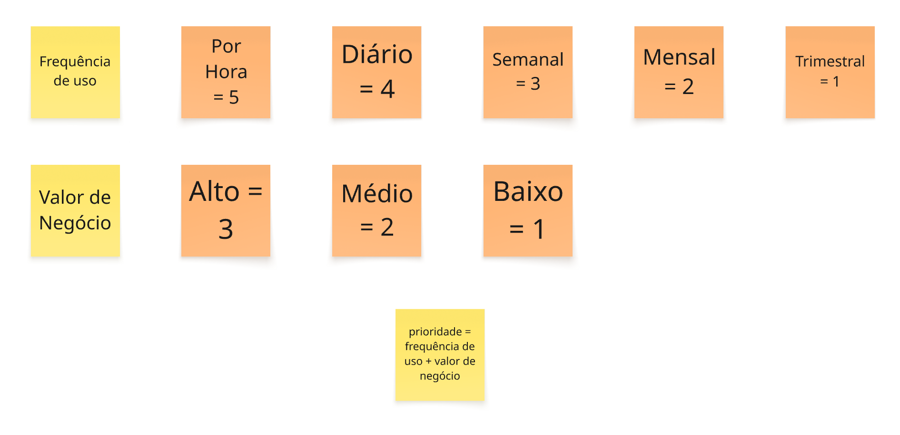

# PBB InovaHub

## Introdução

- Aqui vamos descrever um Product Backlog Building (PBB) um método e um Canvas que auxilia na elaboração e no refinamento colaborativo de um Product Backlog , buscando um entendimento compartilhado do produto e alinhando os envolvidos para um trabalho ágil e eficaz. A atividade aqui descrita utiliza o PBB para estruturar a solução para a "InovaHub", uma rede de inovação e empreendedorismo, abordando seus desafios e propondo funcionalidades integradas. Primeiro introduziramos o estudo de caso, após isso mostraremos o PBB como um todo focando na estrutura e por fim cada parte do PBB

## introdução estudo de caso

A "InovaHub" é uma rede nacional que conecta incubadoras, parques tecnológicos, startups e aceleradoras, com o objetivo de fomentar o desenvolvimento de negócios inovadores e fortalecer o ecossistema de colaboração entre universidades, empresas e governos.

O desafio central é a fragmentação de informações e processos. Atualmente, cada parceiro utiliza sistemas próprios, resultando em:

- Redundância e Desgaste: Empreendedores preenchem múltiplos formulários para se candidatar a programas distintos.
- Gestão Ineficiente: A gestão de mentorias, o acompanhamento de startups (KPIs, crescimento, faturamento) e os relatórios de desempenho são feitos manualmente via planilhas e e-mails, dificultando a visão global e a avaliação de impacto.
- Falta de Transparência e Visibilidade: A dispersão de dados prejudica a captação de recursos e a mensuração de resultados em tempo real.

Diante disso, a InovaHub busca uma plataforma digital integrada capaz de conectar todos os atores (empreendedores, gestores, mentores, investidores e gestores públicos), monitorar o progresso das startups e consolidar dados estratégicos.

## Explicação da Estrutura do Product Backlog Building (PBB)

- O Product Backlog Building (PBB) é estruturado por cinco seções principais, que guiam a equipe desde o entendimento do contexto e dos problemas até a identificação dos itens concretos de trabalho (PBIs).
Abaixo está a estrutura completa para o caso "InovaHub", seguindo a ordem ideal para a construção e refinamento do Product Backlog:

1. Contexto e Visão
* **Problemas:** Define o ponto de partida, listando as dores e os desafios atuais (o estado inicial).
* **Expectativas:** Define o ponto de chegada, listando os benefícios e o valor esperado (o estado futuro desejado).

2. Atores e Ações
* **Personas:** Identifica quem interage com o sistema e define o que cada uma faz e o que espera do novo produto.
* **Funcionalidades (Features):** Agrupa as ações de alto nível que o sistema deve executar para que as Personas atinjam suas expectativas, resolvendo os Problemas.

3. Detalhamento e Fluxo
* **PBIs (Product Backlog Items):** São os itens de trabalho, o detalhamento das funcionalidades. Cada PBI é um passo concreto (muitas vezes no formato Ação-Resultado-Objeto - ARO) necessário para construir a Feature.
* **Steps Map:** Mapeia os PBIs em um fluxo sequencial, representando a jornada de trabalho.
* **Priorização (COORG):** Organiza os PBIs de forma vertical (por importância) e horizontal (por sequência lógica), definindo a ordem de entrega do Backlog.

----

## Problemas

Esta seção descreve os principais desafios e dores enfrentados pelo ecossistema de inovação da InovaHub antes da implementação da nova plataforma integrada:

* **Fragmentação de Sistemas e Dados:** As instituições parceiras utilizam sistemas próprios para gerenciar startups, mentorias e editais, resultando em plataformas e formatos diversos. Isso causa redundância, retrabalho e perda de dados estratégicos.
* **Redundância e Esforço Manual nas Inscrições:** Empreendedores precisam preencher múltiplos formulários para se candidatar a diferentes programas, gerando desgaste. Os dados raramente são reaproveitados entre as instituições.
* **Ausência de Gestão e Registro de Mentorias:** As mentorias são agendadas individualmente e não há um sistema para registrar encontros, temas abordados ou resultados obtidos, dificultando o acompanhamento do progresso.
* **Inexistência de Monitoramento Unificado de Startups:** O acompanhamento do desempenho das startups (KPIs, faturamento, equipe) é feito por planilhas próprias de cada incubadora, impedindo uma visão global do ecossistema e a identificação de padrões de sucesso ou risco.
* **Geração de Relatórios Lenta, Manual e Não Confiável:** A consolidação de relatórios sobre desempenho e maturidade é feita manualmente (via planilhas e e-mails), consumindo tempo, reduzindo a confiabilidade das informações e impedindo o acompanhamento de métricas em tempo real.
* **Baixa Visibilidade e Acesso a Oportunidades (Editais e Networking):** Editais e projetos são divulgados em diferentes portais, e não há um canal estruturado para empreendedores acessarem oportunidades, nem para investidores identificarem startups promissoras.
* **Dificuldade na Mensuração de Impacto das Políticas Públicas:** A ausência de métricas e dashboards integrados dificulta para gestores públicos e analistas de fomento avaliar e prestar contas sobre o impacto dos recursos aplicados e orientar novos investimentos.

## Expectativas

- Esta seção lista os resultados e benefícios esperados com o desenvolvimento da plataforma, representando o estado futuro desejado para o ecossistema da InovaHub:

* **Desenvolver uma Plataforma Digital Integrada:** O objetivo central é criar uma solução que unifique o ambiente, substituindo os sistemas dispersos e manuais.
* **Ser Capaz de Conectar Atores, Monitorar e Consolidar Dados Estratégicos:** A plataforma deve articular a jornada do empreendedor, conectar incubadoras, mentores e investidores, além de consolidar informações de desempenho para a tomada de decisão.
* **Favorecer o Aprendizado Contínuo, a Transparência e o Compartilhamento de Oportunidades:** A solução deve otimizar a interação entre os parceiros, permitindo o compartilhamento de boas práticas e a visibilidade de oportunidades de fomento e networking.
* **Sustentar um Ecossistema de Inovação Aberto, Colaborativo e Sustentável:** A plataforma deve fornecer a base tecnológica para transformar os desafios organizacionais atuais em valor social, econômico e tecnológico duradouro.

## Personas

- Esta seção identifica os principais atores do ecossistema e detalha seus desafios (o que fazem hoje) e suas expectativas (o que esperam da nova plataforma):

**Gestor de Inovação**
* **O que faz:** Coordena uma incubadora, seleciona startups, acompanha resultados e presta contas a financiadores.
* **O que espera:** Padronizar os processos de inscrição e avaliação e ter um sistema unificado para gerenciar incubação e aceleração, com relatórios automáticos.

**Empreendedor de Startup**
* **O que faz:** Fundador de uma startup em fase inicial, lida com diferentes plataformas e preenche múltiplos formulários de inscrição. Busca apoio técnico e financeiro para validar seu modelo de negócio.
* **O que espera:** Centralizar informações para se inscrever em editais em uma única plataforma, agendar mentorias, acompanhar os KPIs do seu negócio e acessar oportunidades de fomento e networking.

**Mentor de Negócios**
* **O que faz:** Atua voluntariamente como mentor, mas perde tempo tentando organizar agendas e registros de acompanhamento, sem acesso consolidado às informações.
* **O que espera:** Melhorar o acompanhamento das startups e otimizar a gestão do seu tempo, registrando feedbacks, planos de ação e a evolução das mentorias em tempo real.

**Analista de Inovação**
* **O que faz:** Analisa o desempenho de programas, lida com relatórios extensos e dados inconsistentes, e tem dificuldade em medir o impacto dos recursos aplicados.
* **O que espera:** Dispor de dados padronizados e confiáveis, utilizando dashboards com métricas consolidadas para mensurar o impacto dos programas e filtrar startups por setor, fase e performance.

**Investidor Anjo**
* **O que faz:** Acompanha startups em estágios iniciais e busca oportunidades de investimento, mas tenta identificar startups promissoras sem um canal estruturado.
* **O que espera:** Identificar startups promissoras e avaliar sua maturidade com base em evidências, acessando relatórios de desempenho e consultando o histórico de evolução das startups e dados qualificados.

**Gestor Público de Empreendedorismo**
* **O que faz:** Gerencia programas de incentivo à inovação e tenta acompanhar o impacto das políticas públicas, mas enfrenta dificuldades para reunir informações confiáveis e tem uma visão sistêmica limitada.
* **O que espera:** Acompanhar de forma integrada o desempenho do ecossistema, apoiar a formulação de políticas de incentivo, consultar um painel consolidado de indicadores regionais, obter relatórios de impacto e visualizar conexões entre atores.

## Funcionalidades

- Esta seção lista as funcionalidades de alto nível propostas, identificando os problemas que resolvem e os benefícios que trazem para as Personas:

**Realizar Cadastro Único e Simplificar Inscrições**
* **Problemas Resolvidos:** Sobrecarga por preencher múltiplos formulários; lidar com diferentes plataformas; redundância e desgaste causados por dados raramente reaproveitados entre instituições.
* **Benefícios Entregues:** Economia de tempo e redução do desgaste; possibilidade de se candidatar a mais programas com menos esforço.

**Gerenciar Seleções e Editais**
* **Problemas Resolvidos:** Triagem manual das inscrições recebidas por e-mail; falta de critérios padronizados ou histórico de desempenho anterior para avaliar as startups.
* **Benefícios Entregues:** Otimização do processo de seleção; garantia de uma avaliação padronizada e mais justa dos candidatos; redução do retrabalho na gestão de inscrições.

**Acompanhar Startups Incubadas**
* **Problemas Resolvidos:** Dificuldade em consolidar dados de desempenho das startups; dificuldade em comparar resultados entre programas; uso de planilhas próprias não consolidadas.
* **Benefícios Entregues:** Automatização da prestação de contas com relatórios automáticos; visão clara, padronizada e consolidada do desempenho do seu portfólio.

**Registrar e Gerenciar Mentorias**
* **Problemas Resolvidos:** Falta de acesso consolidado às informações das startups que orienta; perda de tempo tentando organizar reuniões e registros de acompanhamento; ausência de um sistema que registre os encontros, os temas abordados ou os resultados obtidos.
* **Benefícios Entregues:** Otimizar a gestão do tempo; centralização das informações para melhorar o acompanhamento e avaliar o impacto das orientações.

**Acompanhar o Progresso da Startup (KPIs)**
* **Problemas Resolvidos:** Acompanhamento feito por múltiplos canais; ausência de um espaço digital unificado que articule a jornada do empreendedor.
* **Benefícios Entregues:** Visão clara do próprio progresso; facilidade para compartilhar seus indicadores de progresso com gestores e mentores.

**Centralizar Oportunidades (Editais e Conexões)**
* **Problemas Resolvidos:** Busca manual por editais divulgados em diferentes portais; dificuldade em conectar-se com mentores; comunicações dispersas.
* **Benefícios Entregues:** Centralização de todas as oportunidades (editais, mentores) em um único ambiente; acesso facilitado a recursos e networking.

**Identificar e Avaliar Startups (Perfil e Histórico)**
* **Problemas Resolvidos:** Não possuir um canal estruturado para identificar startups promissoras; falta de dados qualificados e históricos de evolução de cada empreendimento; falta de métricas de tração e governança.
* **Benefícios Entregues:** Acesso a dados qualificados e indicadores de mercado e governança para avaliar investimentos; capacidade de avaliar com base em evidências.

**Analisar Métricas e Performance de Programas**
* **Problemas Resolvidos:** Lidar com relatórios extensos e dados inconsistentes; dificuldade na medição do impacto dos recursos aplicados; geração de relatórios de forma manual que consome tempo e reduz a confiabilidade das informações.
* **Benefícios Entregues:** Dispor de dados padronizados e confiáveis; agilidade na tomada de decisão e na prestação de contas.

**Acompanhar o Impacto do Ecossistema**
* **Problemas Resolvidos:** Dificuldades para reunir informações confiáveis de diferentes instituições; falta de uma visão sistêmica do ecossistema; obstáculos para mensurar o impacto dos investimentos e das políticas públicas.
* **Benefícios Entregues:** Obter relatórios de impacto e relatórios comparativos; basear a orientação de novos investimentos e políticas de incentivo em dados consolidados.

## PBIs (Product Backlog Items)

## Steps Map

## COORG

- A técnica COORG é utilizada para realizar a priorização do Product Backlog, definindo em qual ordem os PBIs (Product Backlog Items) serão desenvolvidos. A primeira etapa é a **Classificação**, onde os itens são pontuados com base em critérios e uma fórmula:

- Critérios de Classificação

**1. Frequência de Uso:**
* **Por Hora** = 5
* **Diário** = 4
* **Semanal** = 3
* **Mensal** = 2
* **Trimestral** = 1

**2. Valor de Negócio:**
* **Alto** = 3 (Muito importante, principal, com alto valor de negócio)
* **Médio** = 2 (Relevância, valor de negócio médio)
* **Baixo** = 1 (Faz sentido, mas não agrega muito valor no momento atual)

- Fórmula de Prioridade

A prioridade de cada PBI é calculada somando-se as pontuações dos critérios:

Prioridade = Frequência\ de\ Uso + Valor\ de\ Negócio

*(Onde a pontuação máxima é 8 e a mínima é 2.)*