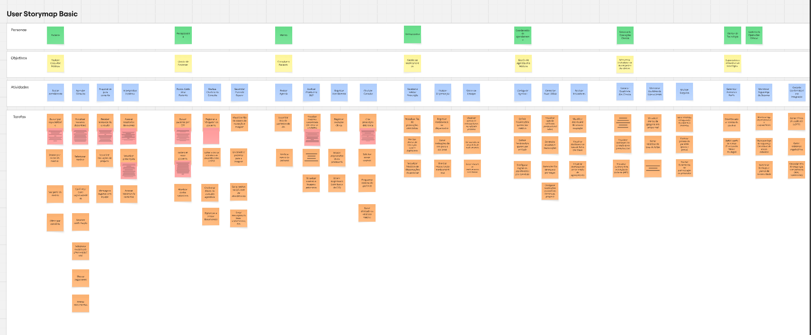
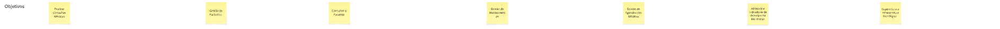
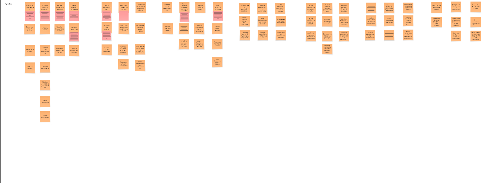

# USM

## Introdução ao Documento

Este documento apresenta a estruturação de requisitos para o projeto "HealthConnect" utilizando a técnica de User Story Mapping (USM). O USM é uma ferramenta visual que organiza o Product Backlog como uma narrativa da jornada do usuário, permitindo o entendimento compartilhado e a definição de Releases de forma incremental e orientada a valor.

---

## Introdução ao Estudo de Caso: HealthConnect

A **HealthConnect** é uma empresa no setor de saúde que busca unificar e transformar a experiência digital em sua rede de clínicas e hospitais. O desafio é superar a **fragmentação** de sistemas legados, a **redundância** de processos (como prontuários incomunicáveis e prescrições manuscritas) e a **baixa interoperabilidade** entre as unidades e parceiros externos. A missão do novo produto é entregar uma plataforma unificada de gestão do cuidado, combinando prontuário eletrônico, agendamento, prescrições eletrônicas e painéis gerenciais, com foco em segurança, usabilidade e interoperabilidade.

---

## Explicação da Estrutura do User Story Mapping (USM)

O User Story Mapping transforma uma lista plana de requisitos em uma estrutura visual hierárquica para facilitar o entendimento e a priorização:

* **Eixo Horizontal (Backbone / Fluxo da Narrativa):** Representa o tempo e a sequência lógica das atividades do usuário.
    * **Atividades:** Os grandes passos ou grupos de tarefas que o usuário realiza para alcançar um objetivo maior (a espinha dorsal do mapa).
    * **Tarefas do Usuário:** Ações de alto nível que compõem a história completa, sequenciadas da esquerda para a direita.

* **Eixo Vertical (Detalhe / Prioridade):** Representa o detalhamento e a importância.
    * **Histórias de Usuário (User Stories):** Detalhes da Feature/Tarefa de alto nível. São escritas na perspectiva do usuário (`Eu, como <papel> quero <ação> para <valor>`) e colocadas verticalmente abaixo da Tarefa que detalham.
    * **Release Slices (Fatias de Entrega):** As linhas horizontais inferiores definem lançamentos incrementais. O nível superior representa o Mínimo Produto Viável (MVP), contendo o menor número de tarefas essenciais para o usuário atingir seu objetivo.

---

## Mapeamento de Histórias e Priorização

### 1. Personas e obejetivos

Esta seção relaciona cada ator do sistema com o principal objetivo de negócio ou a meta que ele busca alcançar ao utilizar a nova plataforma HealthConnect:

* **Paciente**: Realizar Consultas Médicas. O paciente busca autonomia, clareza e segurança no acompanhamento de sua condição crônica.
* **Recepcionista**: Gestão de Pacientes. A Recepcionista é o primeiro contato e é responsável pelo cadastro, atualização de dados e orientação de fluxo.
* **Médico Clínico**: Consultar o Paciente. O Médico precisa de visão clínica integrada e apoio à decisão para registro ágil no atendimento de alta demanda.
* **Farmacêutica**: Gestão de Medicamentos. Responsável por validar prescrições, dispensar medicamentos e orientar o paciente.
* **Coordenador de Agendamento**: Gestão de Agendas dos Médicos. Orquestra agendas de múltiplos especialistas e unidades, buscando equilíbrio entre demanda e capacidade.
* **Gestora de Operações Clínicas**: Administrar indicadores de desempenho das clínicas. Acompanha indicadores assistenciais e operacionais para atuar em melhoria contínua de processos.
* **Diretor de Tecnologia**: Supervisiona a infraestrutura tecnológica. Responsável por garantir a disponibilidade, segurança, conformidade e o roadmap tecnológico da rede.

### 2. Ações/Atividades (Backbone)

Esta seção lista as principais atividades (Tarefas de Usuário - blocos azuis) que compõem o *Backbone* para cada Persona e Objetivo no fluxo da narrativa:

* **Paciente - Objetivo: Realizar Consultas Médicas**
    * Buscar atendimento
    * Agendar Consulta
    * Preparar-se para consulta
    * Acompanhar histórico

* **Recepcionista - Objetivo: Gestão de Pacientes**
    * Buscar/Cadastrar Paciente
    * Realizar Check-in da Consulta
    * Gerenciar Fluxo de Espera

* **Médico Clínico - Objetivo: Consultar o Paciente**
    * Revisar Agenda
    * Analisar Prontuário 360º
    * Registrar Atendimento
    * Finalizar Consulta

* **Farmacêutica - Objetivo: Gestão de Medicamentos**
    * Receber e Validar Prescrição
    * Realizar Dispensação
    * Gerenciar Estoque

* **Coordenador de Agendamento - Objetivo: Gestão de Agendas dos Médicos**
    * Configurar Agendas
    * Gerenciar Fluxo Diário
    * Analisar Indicadores

* **Gestora de Operações Clínicas - Objetivo: Administrar indicadores de desempenho das clínicas**
    * Garantir Qualidade das Clínicas
    * Monitorar Dashboards Operacionais
    * Analisar Gargalos

* **Diretor de Tecnologia - Objetivo: Supervisionar a infraestrutura tecnológica**
    * Gerenciar Acessos e Perfis
    * Monitorar Segurança do Sistema
    * Garantir Conformidade e Integração

### 3. Histórias de Usuário (Tarefas e Detalhes)

#### Tarefas dos Pacientes

Esta seção detalha as tarefas e as regras de negócio/critérios de aceite para o fluxo do Paciente.

**A. Atividade: Buscar atendimento**
* **Buscar por especialidade e Unidade**
    * *Listagem de Opções:* O campo de especialidade deve apresentar todas as especialidades cadastradas na rede.
    * *Seleção de Unidade:* O usuário deve poder selecionar uma unidade específica ou a opção "Todas".
* **Buscar por nome do médico**
* **Filtrar por convênio**
* **Ver perfil do médico**

**B. Atividade: Agendar Consulta**
* **Visualizar horários disponíveis**
    * *Exibição de Livres:* O sistema deve exibir, na lista de resultados, apenas os horários que estão vagos.
    * *Ocultação de Ocupados:* Horários já agendados ou bloqueados não devem aparecer na lista para o paciente.
    * *Ordenação:* Os horários devem ser mostrados em ordem cronológica (do mais próximo para o mais distante).
    * *Informações do Card:* Cada horário disponível deve mostrar o nome do médico e a data correspondente.
* **Selecionar horário**
* **Selecionar modalidade (Presencial/Tele)**
* **Confirmar (com login/cadastro)**
* **Receber confirmação**
* **Efetuar pagamento**

**C. Atividade: Preparar-se para consulta**
* **Visualizar instruções de preparo**
* **Receber lembrete da consulta**
    * *Automação do Envio:* O sistema deve enviar o lembrete automaticamente (sem ação humana) um período definido antes da consulta (ex: 24h ou 48h).
    * *Conteúdo da Mensagem:* A notificação deve exibir claramente a data, o horário e o endereço (unidade) da consulta.
    * *Botões de Ação:* O lembrete deve possuir botões que permitam "Confirmar Presença" ou "Cancelar Agendamento" com apenas um clique.
* **Mensagens seguras com equipe**

**D. Atividade: Acompanhar histórico**
* **Acessar histórico de consultas**
* **Visualizar prescrições**
    * *Ordenação Cronológica:* As receitas devem ser listadas da mais recente para a mais antiga.
    * *Detalhes Essenciais:* O card da prescrição deve exibir claramente o Nome do Medicamento, Dosagem e Posologia (como tomar).
    * *Status de Validade:* O sistema deve indicar visualmente se a receita ainda está "Ativa" ou se está "Vencida".
    * *Opção de Download:* Deve haver um botão funcional para baixar a receita oficial assinada digitalmente (PDF) para uso em farmácias externas.
* **Acessar resultados de exames**
    * *Centralização:* A lista deve exibir exames realizados em qualquer unidade da rede HealthConnect (interoperabilidade).
    * *Indicador de Status:* Exames em não processados pelo laboratório devem aparecer com o status "Em Análise" e sem link de acesso.
    * *Acesso ao Laudo:* Para exames concluídos, o clique deve abrir o laudo técnico (visualização ou PDF).
    * *Data de Realização:* Cada item da lista deve mostrar a data em que o exame foi coletado.0 

#### Tarefas da Recepcionista

Esta seção detalha as tarefas e as regras de negócio/critérios de aceite para o fluxo da Recepcionista, que realiza a Gestão de Pacientes:

**A. Atividade: Buscar/Cadastrar Paciente**
* **Buscar paciente por CPF**
    * *Busca Global:* A pesquisa pelo CPF deve varrer a base de dados de **todas** as unidades da rede, e não apenas da clínica local.
    * *Identificação Positiva:* O resultado da busca deve exibir Nome Completo, Data de Nascimento e Nome da Mãe para garantir que é a pessoa correta.
    * *Tratamento de Erro:* Caso o CPF não seja encontrado, o sistema deve exibir a mensagem "Paciente não encontrado" e habilitar um botão de atalho para "Cadastrar Novo".
    * *Busca Alternativa:* O sistema deve permitir a busca por Nome Completo + Data de Nascimento caso o paciente não saiba o CPF.
* **Cadastrar novo paciente**
    * *Campos Obrigatórios:* O botão "Salvar" deve permanecer desabilitado até que Nome, CPF, Data de Nascimento e Telefone sejam preenchidos.
    * *Bloqueio de Duplicidade:* O sistema deve impedir a criação de um novo registro se o CPF informado já existir na base ativa.
* **Atualizar dados cadastrais**

**B. Atividade: Realizar Check-in da Consulta**
* **Registrar a "chegada" do paciente**
    * *Mudança de Status:* Ao clicar em "Confirmar Chegada", o status do agendamento deve mudar imediatamente de "Agendado" para "Em Espera" (ou "Aguardando Triagem").
    * *Bloqueio de Ação:* O sistema não deve permitir registrar a chegada se a consulta estiver com status "Cancelada" ou se a data do agendamento não for a data atual (hoje).
    * *Atualização de Listagem:* O nome do paciente deve aparecer imediatamente na lista de "Pacientes na Unidade" ou no painel do Médico.
* **Confirmar dados da consulta agendada**
* **Digitalizar e anexar documentos**
* **Validar e coletar assinatura de consentimentos (LGPD)**

**C. Atividade: Gerenciar Fluxo de Espera**
* **Visualizar fila de espera da recepção e triagem**
* **Gerar senhas ou QR code de atendimento**
* **Encaminhar paciente para a triagem**
* **Enviar mensagens de boas-vindas/instruções**

#### Tarefas do Médico Clínico

Esta seção detalha as tarefas e as regras de negócio/critérios de aceite para o fluxo do Médico Clínico, que realiza a Consulta do Paciente:

**A. Atividade: Revisar Agenda**
* **Visualizar lista de pacientes do dia**
* **Verificar status do paciente**

**B. Atividade: Analisar Prontuário 360º**
* **Visualizar histórico consolidado (de todas as unidades)**
    * *Conteúdo das Notas:* A listagem deve exibir o texto da evolução clínica, a data do atendimento e o nome do profissional que realizou o registro.
    * *Integração de Unidades:* O histórico deve carregar automaticamente as anotações feitas em **qualquer** clínica da rede HealthConnect, não apenas na atual.
    * *Ordenação Temporal:* Os registros devem ser apresentados obrigatoriamente em ordem cronológica decrescente (do mais recente para o mais antigo).
    * *Identificação da Especialidade:* Cada item da lista deve identificar claramente qual foi a especialidade daquela consulta (ex: "Cardiologia", "Clínica Médica").
* **Ver alertas de alergias e interações medicamentosas**
* **Visualizar exames e imagens anteriores**

**C. Atividade: Registrar Atendimento**
* **Registrar evolução clínica**
* **Anexar arquivos/fotos ao prontuário**
* **Inserir diagnóstico (com busca de CID)**

**D. Atividade: Finalizar Consulta**
* **Criar prescrição eletrônica**
    * *Seleção de Medicamentos:* O sistema deve permitir buscar e selecionar medicamentos a partir de uma base de dados oficial padronizada (evitando digitação livre do nome da droga).
    * *Dados da Posologia:* O sistema deve obrigar o preenchimento dos campos: Dosagem, Via de Administração e Frequência de uso antes de permitir salvar.
    * *Edição de Itens:* O médico deve conseguir adicionar, remover ou editar medicamentos na lista da prescrição atual antes de finalizar o documento.
    * *Geração do Documento:* Ao finalizar, o sistema deve gerar o PDF da receita conforme o padrão visual da HealthConnect.
* **Solicitar novos exames**
* **Programar retorno do paciente**
* **Criar atestado ou relatório médico**

#### Tarefas do Coordenador de Agendamento

Esta seção detalha as tarefas para o fluxo do Coordenador de Agendamento, que realiza a Gestão de Agendas dos Médicos:

**A. Atividade: Configurar Agendas**
* Definir horários/bloqueios por médico
* Definir horários/bloqueios por unidade
* Configurar regras de atendimento por convênio

**B. Atividade: Gerenciar Fluxo Diário**
* Visualizar agenda unificada (médicos/unidades)
* Gerenciar encaixes e realocações
* Gerenciar fila de espera por vagas
* Configurar notificações automáticas (lembretes, preparo)

**C. Atividade: Analisar Indicadores**
* Visualizar dashboard de taxa de ocupação
* Visualizar dashboard de taxa de faltas (no-show)
* Visualizar dashboard de tempo médio de agendamento

# Mapeamento de Histórias e Priorização

### 1. Personas e Objetivos
*(Conteúdo omitido, mas mantém-se na estrutura do documento.)*

### 2. Atividades (Backbone)
*(Conteúdo omitido, mas mantém-se na estrutura do documento.)*

### 3. Histórias de Usuário (Tarefas e Detalhes)

#### Tarefas da Gestora de Operações Clínicas

Esta seção detalha as tarefas para o fluxo da Gestora de Operações Clínicas, que administra indicadores de desempenho das clínicas:

**A. Atividade: Garantir Qualidade das Clínicas**
* Visualizar dashboard de tempo de espera (recepção, atendimento)
* Visualizar dashboard de produtividade (consultas/dia)
* Visualizar dashboard de satisfação do paciente (NPS)

**B. Atividade: Monitorar Dashboards Operacionais**
* Visualizar alertas de gargalos em tempo real
* Gerar relatório de taxa de faltas
* Gerar relatório de volume de reagendamentos

**C. Atividade: Analisar Gargalos**
* Gerar relatórios de segurança do paciente e incidentes
* Rastrear jornada do paciente (ponta a ponta)
* Acessar ferramentas de padronização de protocolos

#### Tarefas do Diretor de Tecnologia

Esta seção detalha as tarefas para o fluxo do Diretor de Tecnologia, que supervisiona a infraestrutura tecnológica:

**A. Atividade: Gerenciar Acessos e Perfis**
* Criar/Desativar contas de usuário
* Definir perfis de acesso (Princípio do Menor Privilégio)

**B. Atividade: Monitorar Segurança do Sistema**
* Monitorar logs de performance e disponibilidade
* Monitorar logs de segurança (tentativas de acesso indevido)
* Gerenciar backups e planos de continuidade

**C. Atividade: Garantir Conformidade e Integração**
* Gerar trilhas de auditoria (LGPD)
* Gerar relatórios regulatórios
* Gerenciar APIs de integração com parceiros (labs, operadoras)

<iframe width="768" height="432"
  src="https://miro.com/app/live-embed/uXjVJn9oRFI=/?embedMode=view_only_without_ui&moveToViewport=-3184,-1085,2955,1427&embedId=684877445259"
  frameborder="0" scrolling="no"
  allow="fullscreen; clipboard-read; clipboard-write"
  allowfullscreen>
</iframe>
